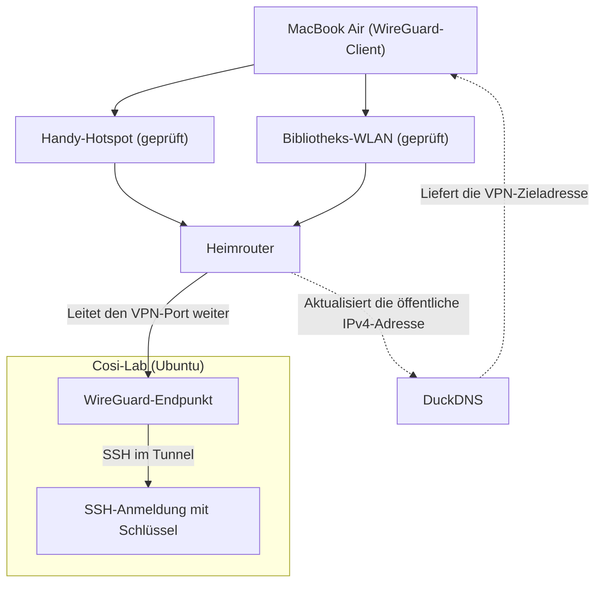

```mermaid
flowchart TB
    Mac["MacBook Air (WireGuard-Client)"]
    Hotspot["Handy-Hotspot (geprüft)"]
    Bibliothek["Bibliotheks-WLAN (geprüft)"]
    Router["Heimrouter"]
    DNS["DuckDNS"]

    subgraph Lab["Cosi-Lab (Ubuntu)"]
        VPN["WireGuard-Endpunkt"]
        SSH["SSH-Anmeldung mit Schlüssel"]
        VPN -->|"SSH im Tunnel"| SSH
    end

    Mac --> Hotspot --> Router
    Mac --> Bibliothek --> Router
    Router -->|"Leitet den VPN-Port weiter"| VPN
    Router -.->|"Aktualisiert die öffentliche IPv4-Adresse"| DNS
    DNS -.->|"Liefert die VPN-Zieladresse"| Mac
```
