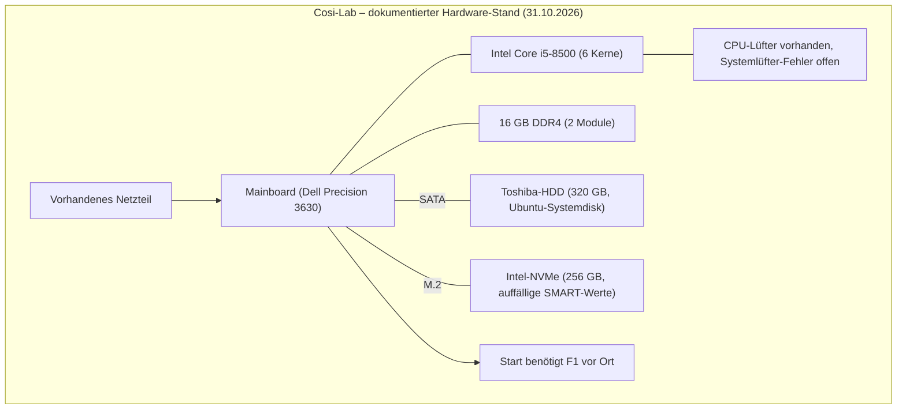

```mermaid
flowchart TB
    subgraph Lab["Cosi-Lab – dokumentierter Hardware-Stand (31.10.2026)"]
        Board["Mainboard (Dell Precision 3630)"]
        CPU["Intel Core i5-8500 (6 Kerne)"]
        RAM["16 GB DDR4 (2 Module)"]
        Netzteil["Vorhandenes Netzteil"]
        HDD["Toshiba-HDD (320 GB, Ubuntu-Systemdisk)"]
        SSD["Intel-NVMe (256 GB, auffällige SMART-Werte)"]
        Kuehlung["CPU-Lüfter vorhanden, Systemlüfter-Fehler offen"]
        Start["Start benötigt F1 vor Ort"]

        Netzteil --> Board
        Board --- CPU
        Board --- RAM
        Board ---|"SATA"| HDD
        Board ---|"M.2"| SSD
        CPU --- Kuehlung
        Board --> Start
    end
```
