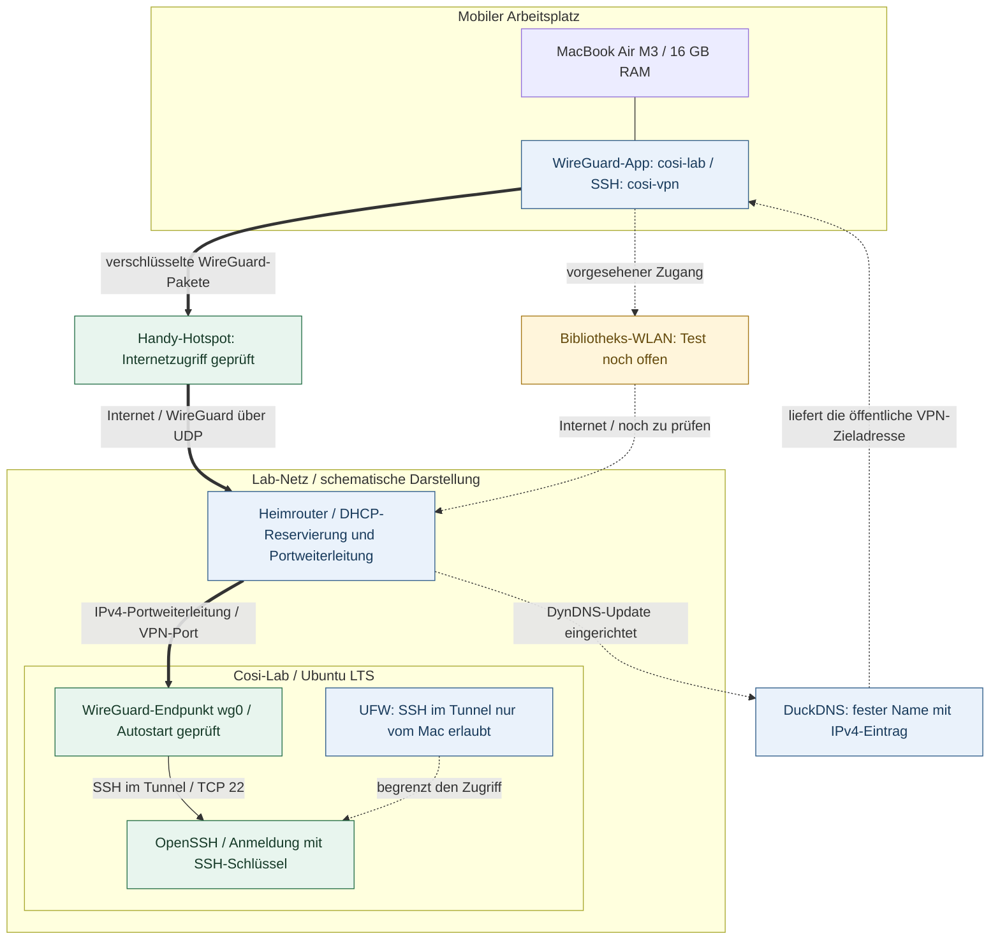
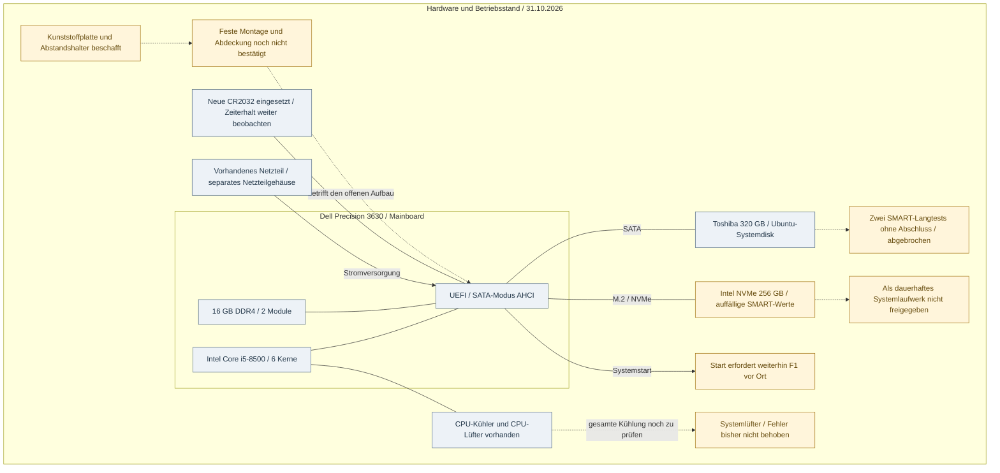

```mermaid
flowchart TB
    subgraph Mobil["Mobiler Arbeitsplatz"]
        Mac["MacBook Air M3 / 16 GB RAM"]
        Client["WireGuard-App: cosi-lab / SSH: cosi-vpn"]
        Mac --- Client
    end

    Hotspot["Handy-Hotspot: Internetzugriff geprüft"]
    Bibliothek["Bibliotheks-WLAN: Test noch offen"]
    DNS["DuckDNS: fester Name mit IPv4-Eintrag"]

    subgraph Heimnetz["Lab-Netz / schematische Darstellung"]
        Router["Heimrouter / DHCP-Reservierung und Portweiterleitung"]
        subgraph Lab["Cosi-Lab / Ubuntu LTS"]
            WG["WireGuard-Endpunkt wg0 / Autostart geprüft"]
            SSH["OpenSSH / Anmeldung mit SSH-Schlüssel"]
            UFW["UFW: SSH im Tunnel nur vom Mac erlaubt"]
            WG -->|"SSH im Tunnel / TCP 22"| SSH
            UFW -.->|"begrenzt den Zugriff"| SSH
        end
    end

    Client ==>|"verschlüsselte WireGuard-Pakete"| Hotspot
    Hotspot ==>|"Internet / WireGuard über UDP"| Router
    Client -.->|"vorgesehener Zugang"| Bibliothek
    Bibliothek -.->|"Internet / noch zu prüfen"| Router
    Router ==>|"IPv4-Portweiterleitung / VPN-Port"| WG
    Router -.->|"DynDNS-Update eingerichtet"| DNS
    DNS -.->|"liefert die öffentliche VPN-Zieladresse"| Client

    classDef geprueft fill:#e8f5ee,stroke:#28714a,color:#163a28
    classDef offen fill:#fff5db,stroke:#a67918,color:#654a0c
    classDef dienst fill:#eaf2fb,stroke:#315e8a,color:#193b5c
    class Hotspot,WG,SSH geprueft
    class Bibliothek offen
    class Router,DNS,Client,UFW dienst
```

```mermaid
flowchart TB
    subgraph Hardware["Hardware und Betriebsstand / 31.10.2026"]
        subgraph Mainboard["Dell Precision 3630 / Mainboard"]
            CPU["Intel Core i5-8500 / 6 Kerne"]
            RAM["16 GB DDR4 / 2 Module"]
            Board["UEFI / SATA-Modus AHCI"]
            CPU --- Board
            RAM --- Board
        end

        Netzteil["Vorhandenes Netzteil / separates Netzteilgehäuse"]
        HDD["Toshiba 320 GB / Ubuntu-Systemdisk"]
        SSD["Intel NVMe 256 GB / auffällige SMART-Werte"]
        Boot["Start erfordert weiterhin F1 vor Ort"]

        Netzteil -->|"Stromversorgung"| Board
        Board ---|"SATA"| HDD
        Board ---|"M.2 / NVMe"| SSD
        Board -->|"Systemstart"| Boot

        CPUFan["CPU-Kühler und CPU-Lüfter vorhanden"]
        SystemFan["Systemlüfter / Fehler bisher nicht behoben"]
        CPU --- CPUFan
        CPUFan -.->|"gesamte Kühlung noch zu prüfen"| SystemFan

        CR2032["Neue CR2032 eingesetzt / Zeiterhalt weiter beobachten"]
        Montage["Kunststoffplatte und Abstandshalter beschafft"]
        Aufbau["Feste Montage und Abdeckung noch nicht bestätigt"]
        CR2032 --- Board
        Montage -.-> Aufbau
        Aufbau -.->|"betrifft den offenen Aufbau"| Board

        HDDTest["Zwei SMART-Langtests ohne Abschluss / abgebrochen"]
        SSDStatus["Als dauerhaftes Systemlaufwerk nicht freigegeben"]
        HDD -.-> HDDTest
        SSD -.-> SSDStatus
    end

    classDef offen fill:#fff5db,stroke:#a67918,color:#654a0c
    classDef bestand fill:#edf2f7,stroke:#526b82,color:#24384a
    class Board,CPU,RAM,Netzteil,HDD,CPUFan,CR2032 bestand
    class SSD,Boot,SystemFan,Montage,Aufbau,HDDTest,SSDStatus offen
```
